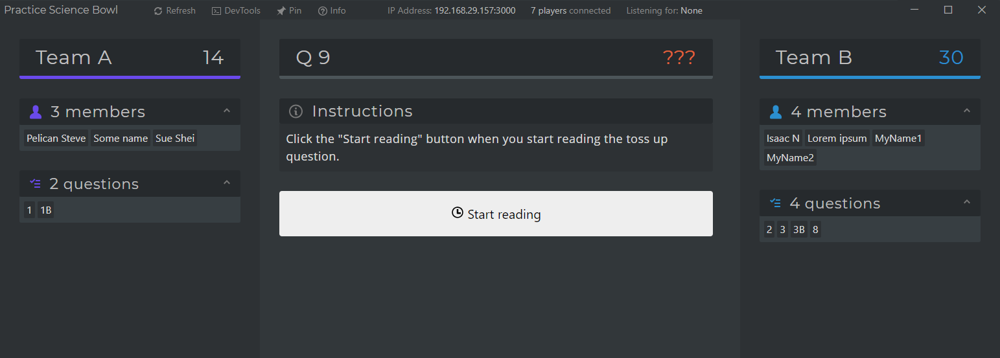
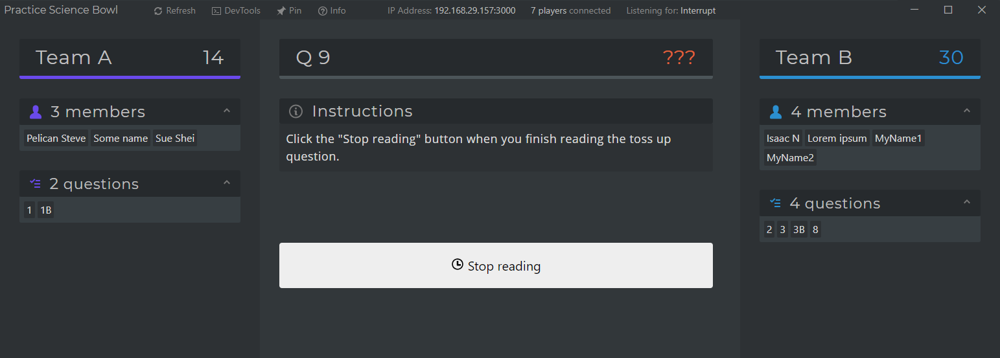
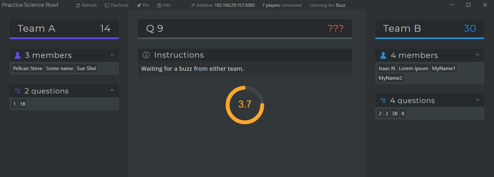
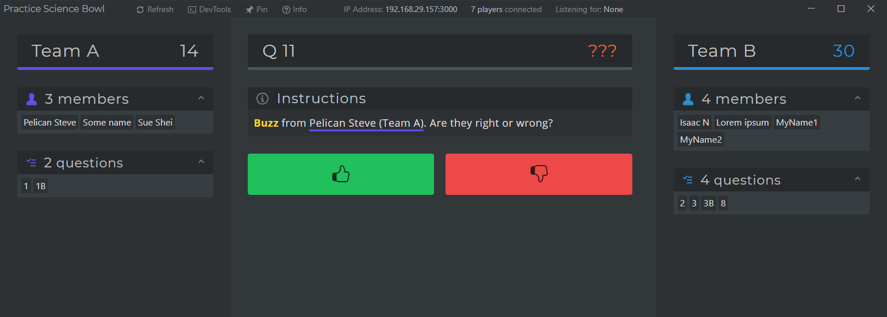
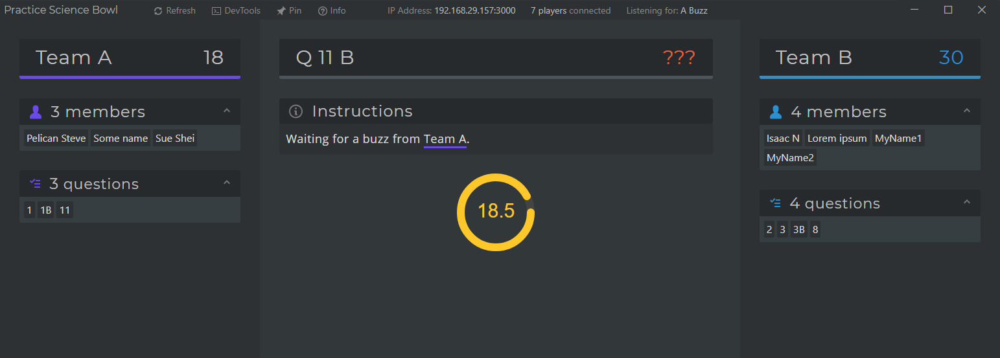
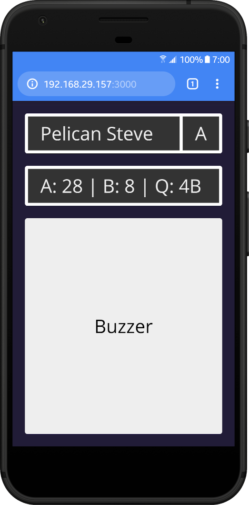

# Practice Science Bowl

Electron app and server for running a practice National Science Bowl round.

Features:

- 5 second tossup timer and 20 second bonus timer
- Unlimited number of players on each team
- Players can use their phones as a buzzer
- Allows for interrupts
- Correctly keeps score
- Follows the rest of the official rules of NSB

Nonfeatures:

- No way to record blurts
- Players need to be on the same WiFi network as the server
- Server only works on Windows

## How to use

1. Get the latest version of the desktop app from [releases](https://github.com/TwoTau/PracticeBowl/releases).
2. Unzip the release and run `practice-bowl.exe` on a Windows computer.
3. Each player should connect to the same WiFi network as the computer with their phone or other device.
4. Players should go to the IP address listed at the top of the desktop app from a browser, something like `192.168.29.152:3000`.
5. Follow the instructions on the app :wink:

Using the `Pin` button on the server app is useful when you want to keep the window "always on top" while you have another app open.

## Desktop/Server screenshots

**Start reading a (tossup) question:**

**While reading a (tossup) question** (listening for interrupts from either team):

**5 second timer for tossups** (listening for a buzz from either team):

**When a team buzzes in:**

**20 second timer for bonus question** (listening for a buzz from the team that answered the previous tossup):

## Client/Player screenshots

Shows the players name, team, score, and a buzzer button.

